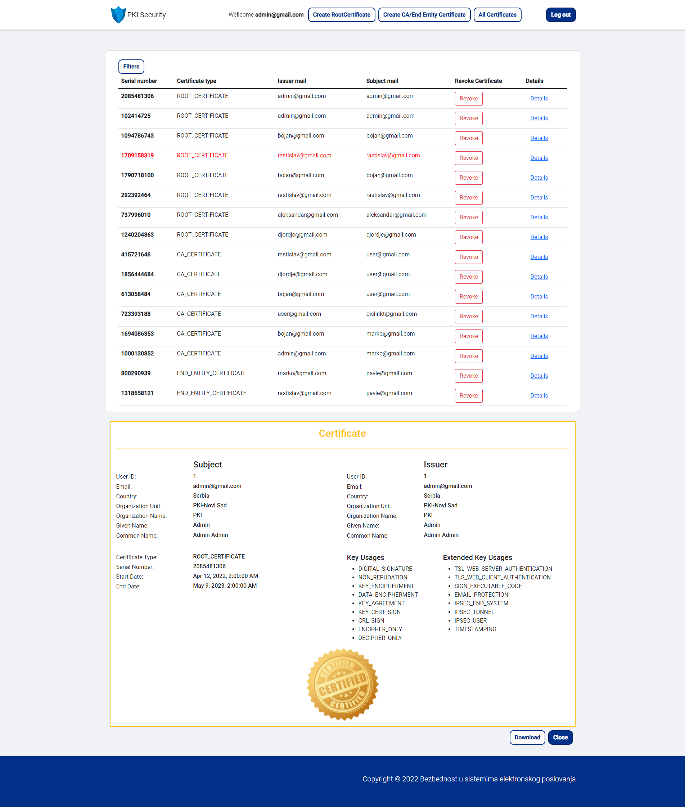
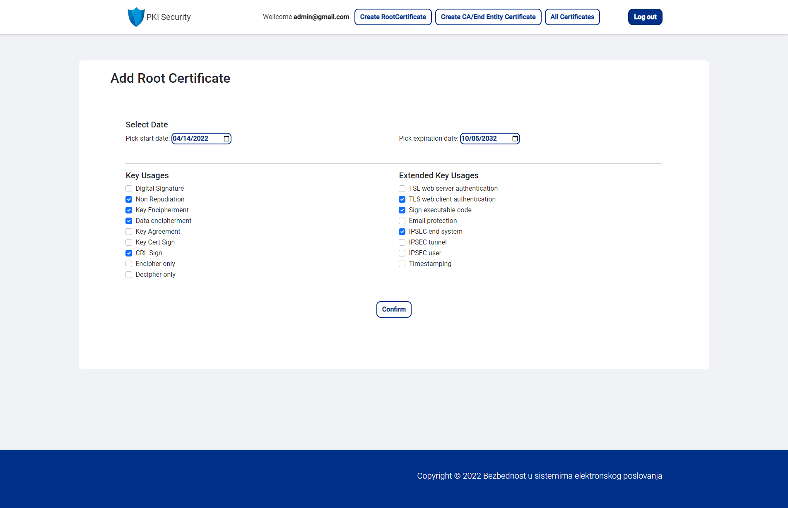
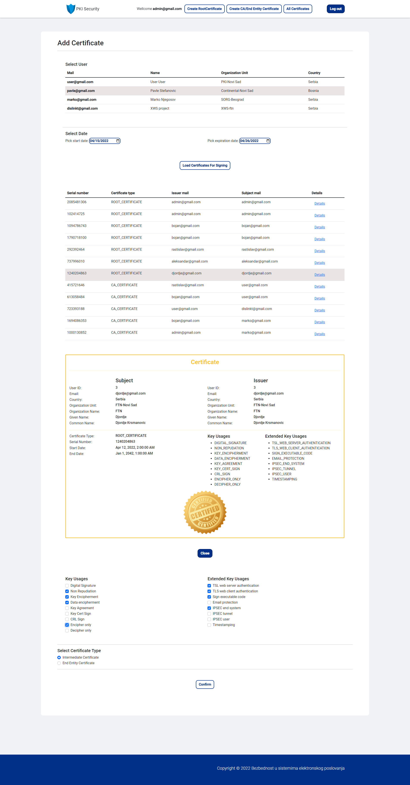
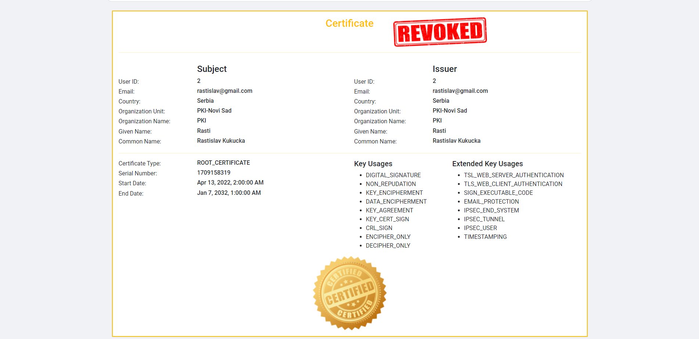

# Academic project PKI (Public key infrastructure)

Web PKI project. Web application for managing, creating, retrieving and revokating public keys.
Project made for Faculty of Technical Sciences' course "Bezbednost u Sistemima Elektronskog Poslovanja".

## PKI

### Wellcome page

### All certified in one place

### Creating self signed certificate

### Creating Certificate Authority

### Example of a revoked certificate

